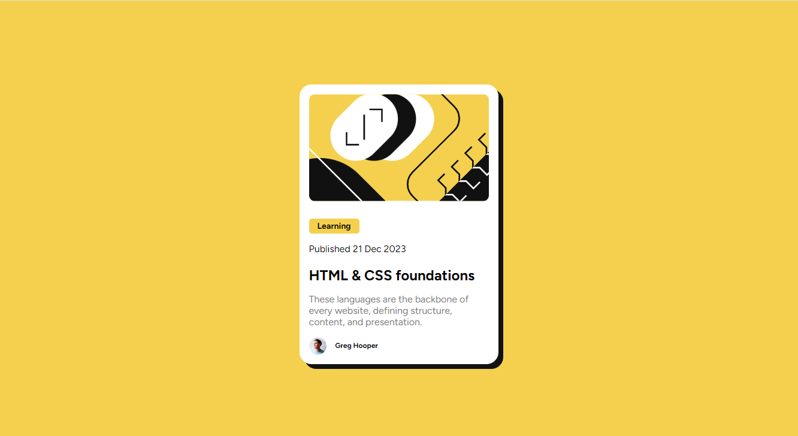
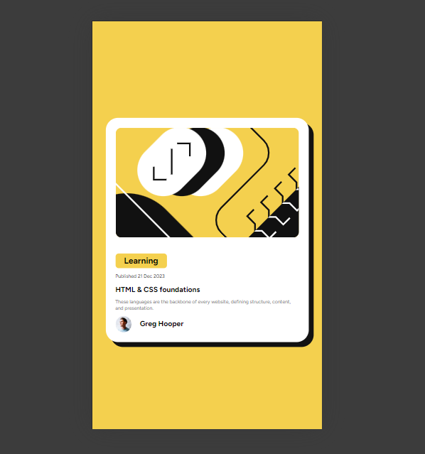

# Frontend Mentor - Blog preview card solution

## Table of contents

- [Overview](#overview)
  - [The challenge](#the-challenge)
  - [Screenshot](#screenshot)
  - [Links](#links)
- [My process](#my-process)
  - [Built with](#built-with)
  - [What I learned](#what-i-learned)
  - [Continued development](#continued-development)
  - [Useful resources](#useful-resources)
- [Author](#author)
- [Acknowledgments](#acknowledgments)

## Overview

### The challenge

Users should be able to:

- See hover and focus states for all interactive elements on the page

### Screenshot

### Links

- Solution URL: [Add solution URL here](https://github.com/ANTHEIAM/frontend-mentor-blog-preview-card)
- Live Site URL: [Add live site URL here](https://antheiam.github.io/frontend-mentor-blog-preview-card/)

## My process

### Built with

- Semantic HTML5 markup
- CSS custom properties
- Flexbox

## Author

- Frontend Mentor - [@ANTHEIAM](https://www.frontendmentor.io/profile/ANTHEIAM)
- Twitter - [@miaincodeland](https://www.twitter.com/miaincodeland)

